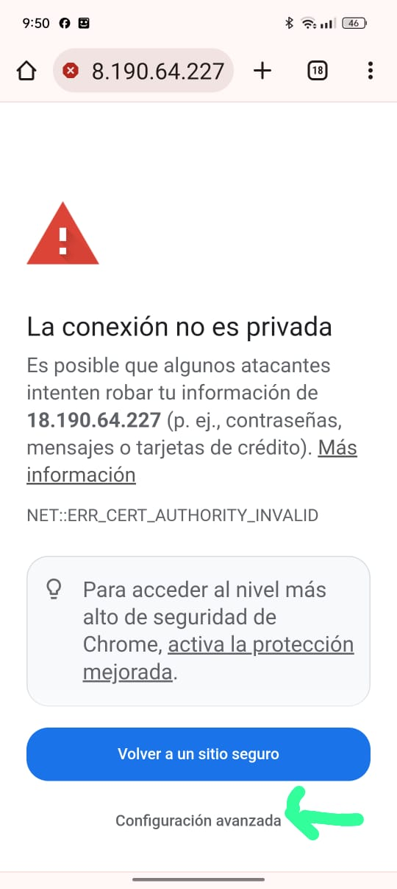
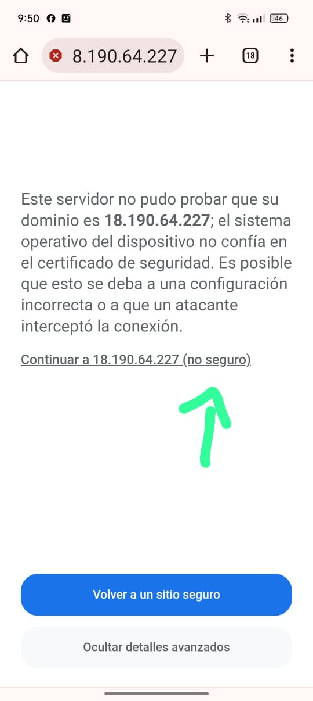
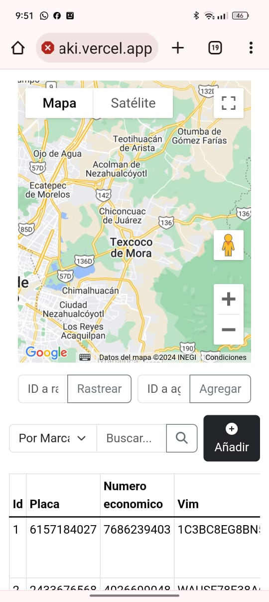
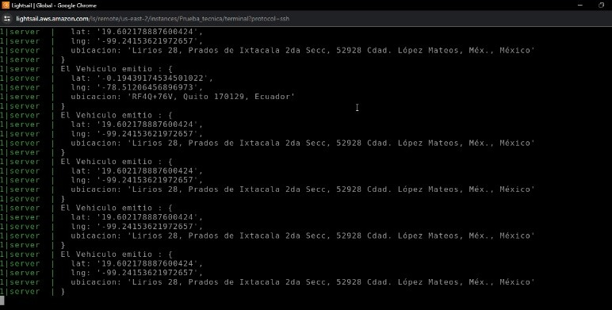

# Finalización del Test Técnico para Desarrollador Fullstack

## Anotaciones Importantes

- Se implementó un live demo en Vercel. Por tal motivo, fue necesario crear un servidor HTTP. Debido al tiempo limitado, generé un certificado SSL auto-firmado. Al entrar a la demo, es posible que no se carguen los vehículos de la aplicación. La solución que encontré para que confiara en la dirección IP donde tengo levantado el Servidor es la siguiente:

  1. Lo primero será entrar a esta dirección IP en el explorador: "https://18.190.64.227:443/"
   

  2. A continuación, aparecerá la siguiente advertencia debido al certificado autofirmado. Como el certificado SSL no es de una Organización autorizada, se muestra este error. Por eso, iremos a configuración avanzada.
     

  3. Volverá a salir una nueva advertencia, pero daremos en continuar a "https://18.190.64.227:443/"
     

  4. Esto ya nos permitirá que confíe en nuestra IP del proyecto y nos permita recibir peticiones de esa IP a nuestro front.
     

## Funcionamiento

- Al renderizar la pantalla, te traerá automáticamente todos los vehículos que existen en la base de datos. En ellos se pueden realizar interacciones como eliminar, actualizar y crear. Todos los cambios sufridos en estos registros se verán actualizados al momento gracias al contexto programado para esta tarea.

- Se implementó una barra de búsqueda que busca dependiendo de qué filtro escoja el cliente.

- Para probar el funcionamiento del mapa es de la siguiente manera:

  - Para agregar la dirección a un vehículo, primero se tiene que dar un clic en el mapa en la ubicación que queramos. Además, se agrega un ID que esté en nuestra tabla de registros.

  - Si se desea trastrear un vehículo, solo se debe agregar el ID del vehículo en cuestión al rastrear en la otra casilla. Se pueden ir buscando, y van apareciendo la ruta a la ubicación del usuario en cuestión.
     
